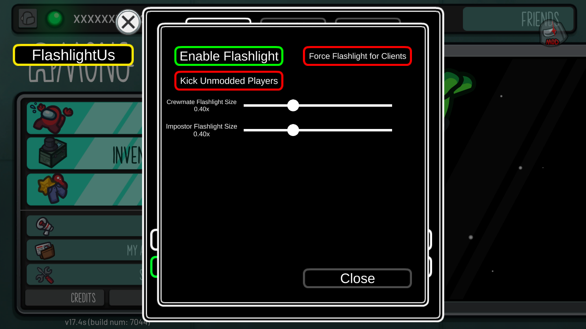
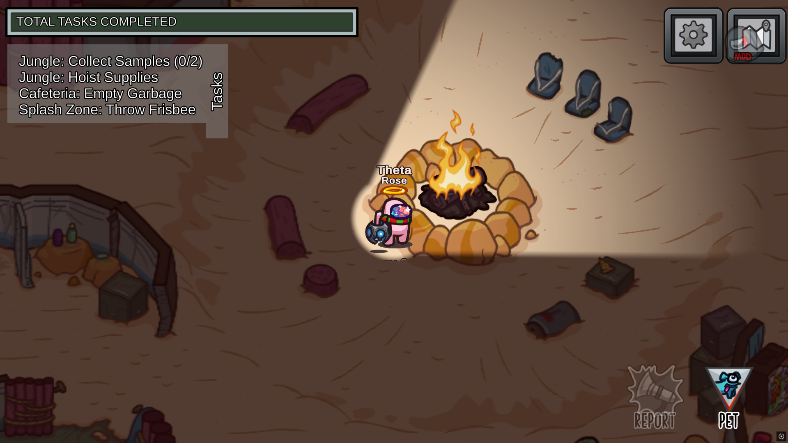

  
<h1 align="center">FlashlightUs</h1>

> ### __A mod for the Among Us game__ 
> This mod is not affiliated with Among Us or Innersloth LLC, and the content contained therein is not endorsed or otherwise sponsored by Innersloth LLC.
 Portions of the materials contained herein are the property of Innersloth LLC.  

### [Download Latest Release](https://github.com/ThetaHalo/FlashlightUs/releases/latest)  

--- 

This mod adds the Flashlight Mode from Hide & Seek to the Normal Mode.  
You may use this in public lobbies, however members of the lobby will also require the mod to be installed in order to use flashlights. You may enable the `Kick Unmodded Players` option if you wish to require everyone in the lobby to be using the mod.

Notice: The flashlight distance follows the host's vision setting, meaning you can still see only as far as the host intends you to. This will not be configurable as it would be considered cheating to see farther than you should be able to.

This mod is also 100% localizable, you can modify *most* strings to whatever you wish.

|           Option           | Description                                                   |
| :------------------------: |---------------------------------------------------------------|
|     Enable Flashlight      | Enables the Flashlight (for you).                             |
|      Force Flashlight      | Forces everyone in the lobby to use the Flashlight (as Host.) |
| Enable Flashlight In Lobby | Enables the flashlight in the lobby dropship.                 |
|   Kick Unmodded Players    | Kicks players who are not using the mod.                      |
|  Crewmate Flashlight Size  | Changes the flashlight width as Crewmate-based roles.         |
|  Impostor Flashlight Size  | Changes the flashlight width as Impostor-based roles.         |                    

__Any mod not listed here has not been tested. If you want your mod to be listed here and are willing to test it, please create an issue.__

| Mod Compatibility  | Status      |                     Notes                     |
|:------------------:|:------------|:---------------------------------------------:|
|   Project: Lotus   | Compatible! |                       .                       | 
| LaunchpadReloaded  | Compatible! | Mouse Movement Text will show in Options Menu |
|  Town of Us Mira   | Compatible! | Mouse Movement Text will show in Options Menu 
| Endless Host Roles | Compatible! |                       .                       |

## Gallery

  

